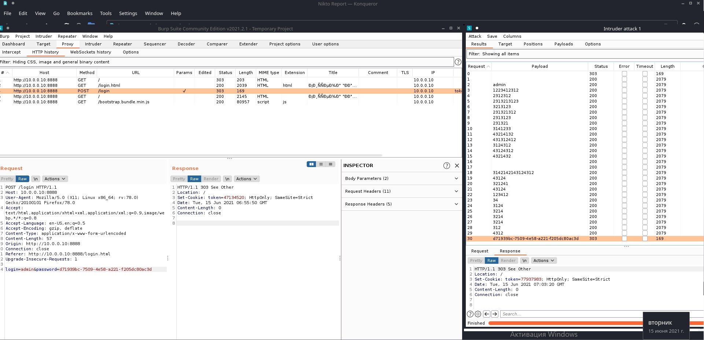
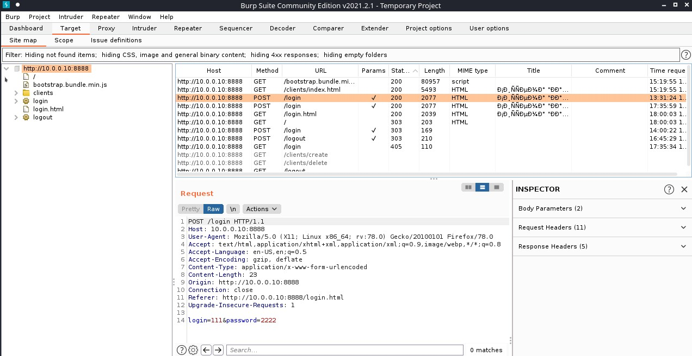
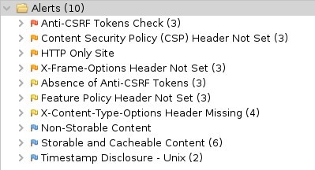
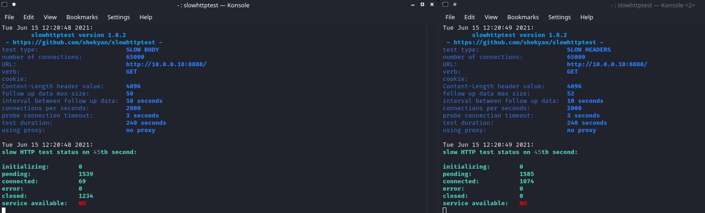

# Дипломное задание "Защищённый контур"

## 1. Несоответствия системы требованиям нормативных документов*

### >>>> ПДн: реализация мер по обеспечению безопасности в части ИАФ, УПД

#### Приказ 21

1.	ИАФ.3	Управление идентификаторами, в том числе создание, присвоение, уничтожение идентификаторов

    > Не реализовано

2. ИАФ.4	Управление средствами аутентификации, в том числе хранение, выдача, инициализация, блокирование средств аутентификации и принятие мер в случае утраты и (или) компрометации средств аутентификации
    > Не реализовано

3. ИАФ.5	Защита обратной связи при вводе аутентификационной информации
    > Не реализовано. Используется HTTP при аутентификации. Является слабостью, есть возможность перехвата аутентификационных данных.

4.  ИАФ.6	Идентификация и аутентификация пользователей, не являющихся работниками оператора (внешних пользователей)
    > Не реализовано

5. УПД.1	Управление (заведение, активация, блокирование и уничтожение) учетными записями пользователей, в   том числе внешних пользователей    
    > Не реализовано. Созданы только функции создания и удаления учётных записей.

6. УПД.2	Реализация необходимых методов (дискреционный, мандатный, ролевой или иной метод), типов (чтение, запись, выполнение или иной тип) и правил разграничения доступа
    > Реализован ролевой метод, не учитывая ошибки реализации описанные в пункте 8.

7. УПД.3	Управление (фильтрация, маршрутизация, контроль соединений, однонаправленная передача и иные способы управления) информационными потоками между устройствами, сегментами информационной системы, а также между информационными системами
    > Не реализовано. Не выполняется требование: " Управление информационными потоками должно блокировать передачу персональных данных через сеть Интернет (или другие информационно-телекоммуникационные сети международного информационного обмена) по незащищенным линиям связи, сетевые запросы и трафик, несанкционированно исходящие из ИСПДн и (или) входящие в ИСПДн."

8. УПД.4	Разделение полномочий (ролей) пользователей, администраторов и лиц, обеспечивающих функционирование информационной системы
    > Не реализовано. В процессе реализации допущены критические ошибки. Основная выявленная ошибка - это возможность доступа к странице "КТ" из под пользователя работающего только с "Клиентами".

9. УПД.5	Назначение минимально необходимых прав и привилегий пользователям, администраторам и лицам, обеспечивающим функционирование информационной системы
    > Не реализовано. На мой взгляд, для уменьшения рисков потери информации нужно использовать больше ролей пользователей, таких как просто оператор с возможностью только вносить данные, старший оператор с возможностями удаления, а так же можно разделить и администраторские аккаунты для лучшей безопасности.

10. Приказ  21	УПД.6	Ограничение неуспешных попыток входа в информационную систему (доступа к информационной системе 
    > Не реализовано. Является слабостью данной системы.

11. УПД.13	Реализация защищенного удаленного доступа субъектов доступа к объектам доступа через внешние информационно-телекоммуникационные сети
    > Не реализовано. Такой вывод сделан в виду отсутствия документации.

12. УПД.14	Регламентация и контроль использования в информационной системе технологий беспроводного доступа
    > Не реализовано. Такой вывод сделан в виду отсутствия документации.

13. УПД.15	Регламентация и контроль использования в информационной системе мобильных технических средств
    > Не реализовано. Такой вывод сделан в виду отсутствия документации.
    
14. УПД.16	Управление взаимодействием с информационными системами сторонних организаций (внешние информационные системы)
    > Не реализовано. Такой вывод сделан в виду отсутствия документации.

15. РСБ.1	Определение событий безопасности, подлежащих регистрации, и сроков их хранения
    > Не реализовано. Логов событий в WEB интерфейсе, а так же в стандартных папках логов, найти не удалось.

16. РСБ.2	Определение состава и содержания информации о событиях безопасности, подлежащих регистрации
    > Не реализовано. Логов событий в WEB интерфейсе, а так же в стандартных папках логов, найти не удалось.

17. РСБ.3	Сбор, запись и хранение информации о событиях безопасности в течение установленного времени хранения
    > Не реализовано. Логов событий в WEB интерфейсе, а так же в стандартных папках логов, найти не удалось.

18. РСБ.7	Защита информации о событиях безопасности
    > Не реализовано. Логов событий в WEB интерфейсе, а так же в стандартных папках логов, натий не удалось.

19. АВЗ.1	Реализация антивирусной защиты
    > Не реализовано.

20. АВЗ.2	Обновление базы данных признаков вредоносных компьютерных программ (вирусов)
    > Не реализовано.

21. АНЗ.2	Контроль установки обновлений программного обеспечения, включая обновление программного обеспечения средств защиты информации
    > Не реализовано.

22. ЗИС.3	Обеспечение защиты персональных данных от раскрытия, модификации и навязывания (ввода ложной информации) при ее передаче (подготовке к передаче) по каналам связи, имеющим выход за пределы контролируемой зоны, в том числе беспроводным каналам связи
    > Не реализовано. Такой вывод сделан в виду отсутсвия документации.

### >>>> КТ: "разрешение или запрет доступа к информации, составляющей коммерческую тайну" посредством механизмов разграничения доступа, встроенных в приложение (механизмы ОС и сторонних сервисов рассматривать не нужно)

1. Документы составляющие коммерческую тайну хранятся в открытом виде на виртуальной машине.
2.  Под пользователем которому разрешён доступ к разделу "Клиенты" можно зайди в раздел "Документы", наоборот не получилось.

## 2. Найденные "слабости" (которые могут привести к уязвимостям) и предложение по необходимым мерам для их устранения (если такие меры возможно принять).

1. Отсутсвие защиты от брутфорса.

    > Не смотря на сложность пароля, мы не ограничены во времени и можем подобрать пароль для админа.

2. Возможность перехвата траффика (HTTP Only Site)
    > На скришоте видно, что логин и пароль передаются в открытом виде.

3. Anti-CSRF Tokens Check (<form action="/login" method="post">))
4. Content Security Policy (CSP) Header Not Set
5. X-Frame-Options header is not included in the HTTP response to protect against 'ClickJacking' attacks.
6. Feature Policy Header Not Set
7. X-Content-Type-Options Header Missing

8. Произвел DOS атаку на сайт:

    > Для пущей надёжности сразу из двух консолей запуском команд:

    > -B               slow body a.k.a R-U-Dead-Yet
    
        slowhttptest -c 65000 -B -i 10 -r 2000 -t GET -u http://10.0.0.10:8888 -x 24 -p 3
    > -H               slow headers a.k.a. Slowloris (default)

        slowhttptest -c 65000 -H -i 10 -r 2000 -t GET -u http://10.0.0.10:8888 -x 24 -p 3
    >  Сайт становится недоступен даже после запуска любой из этих атак.

## Результаты сканирования 

### NMAP

### NIKTO

### ZAP

