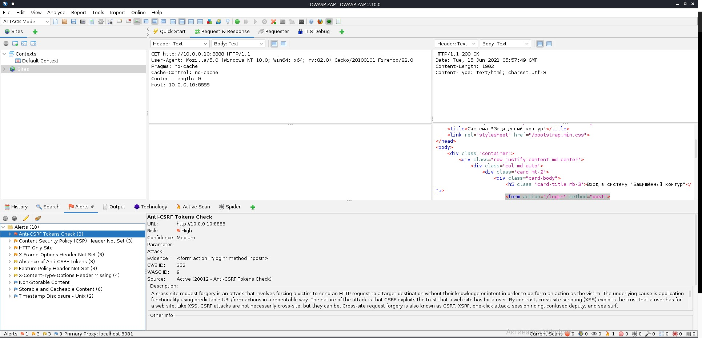

# Дипломное задание "Защищённый контур"

## 1. Несоответствия системы требованиям нормативных документов*

### >>>> ПДн: реализация мер по обеспечению безопасности в части ИАФ, УПД

1. Отсутствует логирование действий операторов работающих с документами КТ.
2. 

### >>>> КТ: "разрешение или запрет доступа к информации, составляющей коммерческую тайну" посредством механизмов разграничения доступа, встроенных в приложение (механизмы ОС и сторонних сервисов рассматривать не нужно)

1. Документы составляющие коммерческую тайну хранятся в открытом виде. Нужно хранить в зашифрованном виде.
2.  Под пользователем которому разрешён доступ к разделу "Клиенты" можно зайди в раздел "Документы", наоборот не получилось.

## 2. Найденные "слабости" (которые могут привести к уязвимостям) и предложение по необходимым мерам для их устранения (если такие меры возможно принять).

1. 
2. 
3. 

## Результаты сканирования 

### NMAP

### NIKTO

### ZAP

