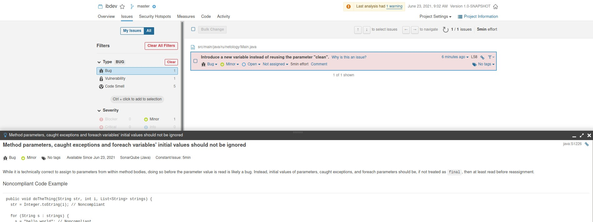
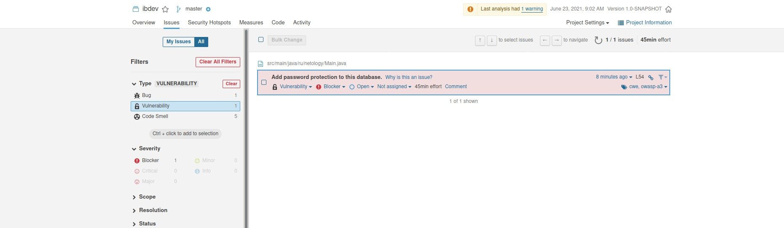
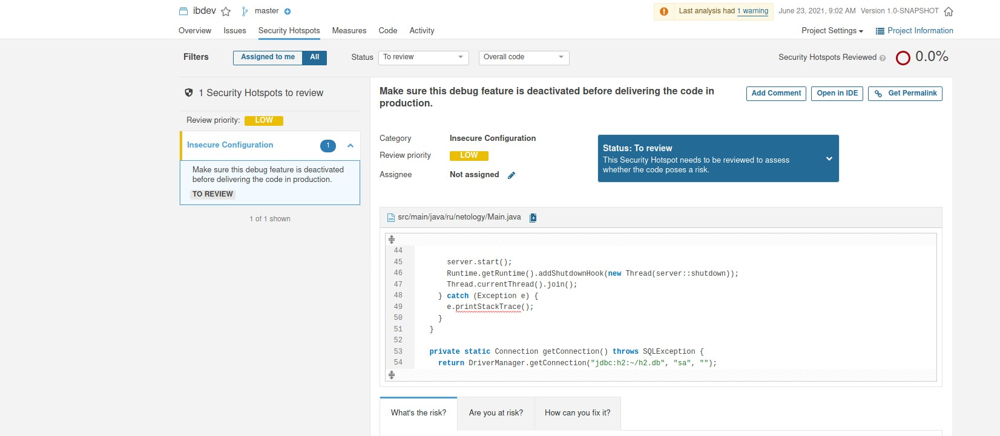
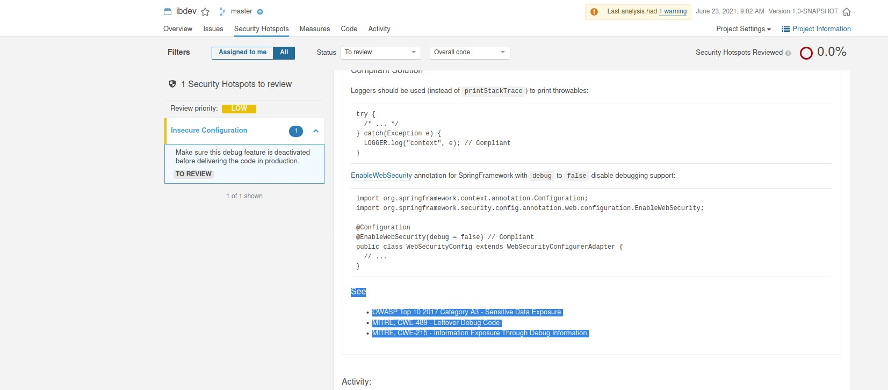
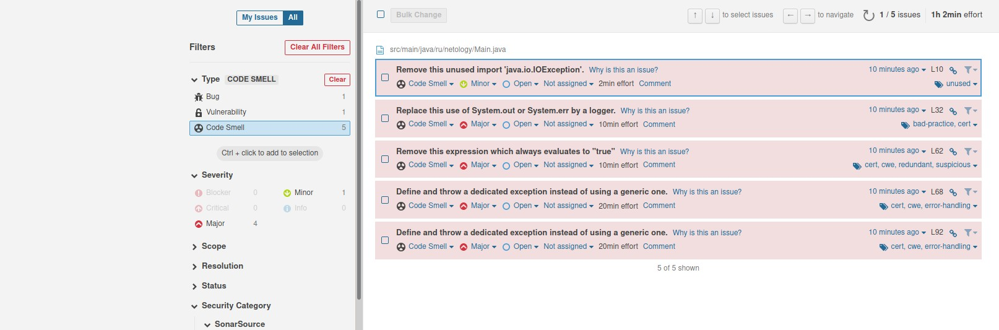

# 1.2. Популярные языки, системы сборки, управления зависимостями

1. Какие баги были выявлены (количество, описание, почему SonarQube их считает багами, см. ссылку Why is this an issue?)

2. Какие уязвимости были выявлены (количество, категории, описание, почему SonarQube их считает уязвимостями)

3. Какие Security Hotspots были выявлены (количество, категории, приоритет, описание, почему SonarQube их считает Security HotSpot'ами)

4. К каким CWE идёт отсылка для Security Hotspots из п.2 (см. вкладку How can you fix it? в нижней части страницы)

5. Какие запахи кода были выявлены (количество, описание, почему SonarQube их считает запахами кода, см. ссылку Why is this an issue?)

