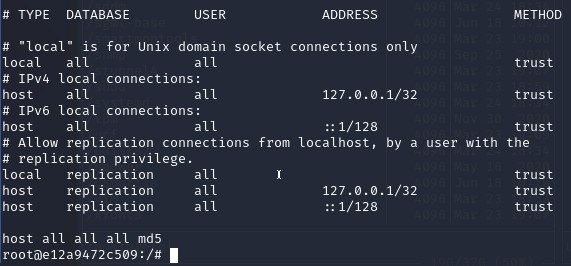
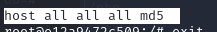
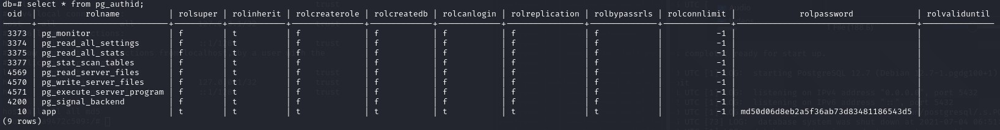
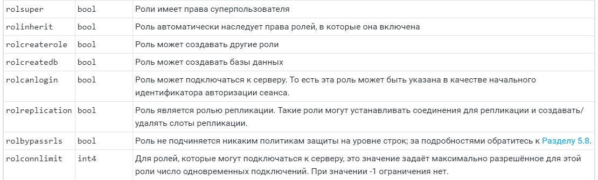

# 2.1 Системы хранения данных (СУБД)

## Задание PostgreSQL Authentication

Пришлите в личном кабинете студента ответы на указанные в разделе Выполнение вопросы:

1. Какие методы аутентификации используются для подключения по TCP/IP с адресов 127.0.0.1/32 и ::1/128?

> trust

2. Какие методы аутентификации используются для подключения по TCP/IP со всех остальных адресов, кроме указанных в предыдущем пункте по протоколу?

> md5

3. Верно ли следующее утверждение: пароль роли app хранится в виде функция_хеширования password (пароль хранится в поле rolpassword)? Если не верно, то приведите описание алгоритма, который используется для хранения хеша.

> "MD5 (англ. Message Digest 5) — 128-битный алгоритм хеширования, разработанный профессором Рональдом Л. Ривестом из Массачусетского технологического института (Massachusetts Institute of Technology, MIT) в 1991 году. Предназначен для создания «отпечатков» или дайджестов сообщения произвольной длины и последующей проверки их подлинности. Широко применялся для проверки целостности информации и хранения хешей паролей."

4. Какое значение (t будет означать да, f - нет) имеют поля rolsuper, rolcreaterole, rolcreatedb, rolbypassrls с указанием назначения данных столбцов (см. https://postgrespro.ru/docs/postgresql/12/catalog-pg-authid)

> Для всех столбцов, у пользователя app, выставлено значение "truth".

5.Почему значения полей rolcanlogin и rolpassword для роли app не изменились и вы по-прежнему можете подключиться с помощью psql без указания пароля, хотя в pg_hba.conf для host all all all указано reject?

> Подключение происходит не извне а внутри контейнера по правилу "local", поэтому используется метод "trust".

## Задание PostgreSQL CIS Benchmarks

1. Какие методы не рекомендуется использовать для удалённых подключений?

2. Какие методы рекомендуется использовать для удалённых подключений?

## Задание PostgreSQL ПРД

Пришлите в личном кабинете студента сообщение, которое отображается вместо ??? в результате выполнения запросов с недостаточными правами доступа: ERROR: ???.