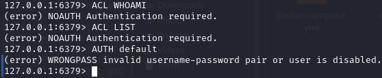
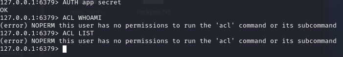
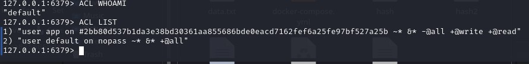
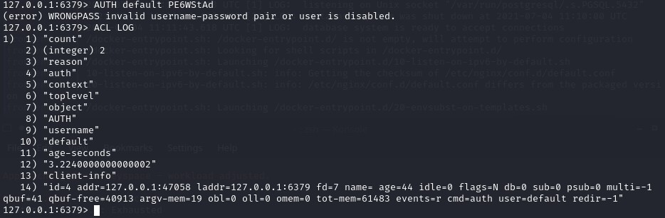
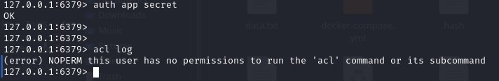

# 2.2 Системы хранения данных (кэши, очереди, файловая система)

## Задание Redis ACL

### 1. По части 2: выводы команд ACL WHOAMI, ACL LIST, AUTH default

### 2. По части 3: выводы команд ACL WHOAMI, ACL LIST

### 3. По части 4: выводы команд ACL WHOAMI, ACL LIST

## Задание Redis ACL LOGS*

### 1. Попытка входа с неверным паролем

### 2. Попытка доступа к запрещённой команде

