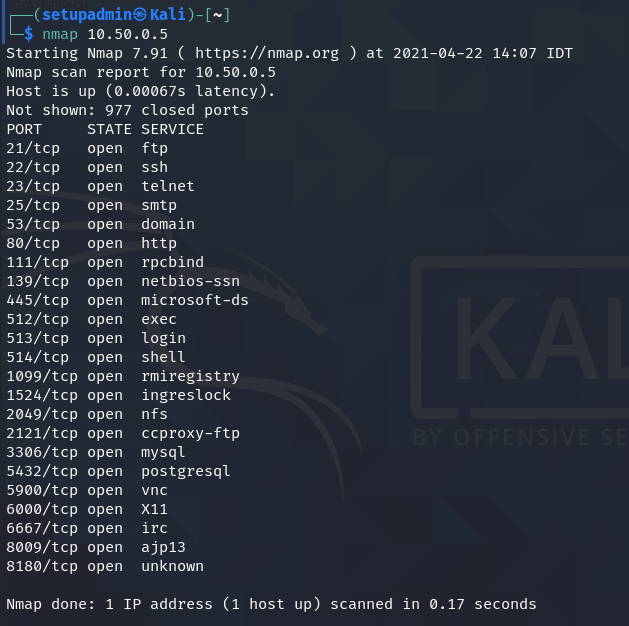
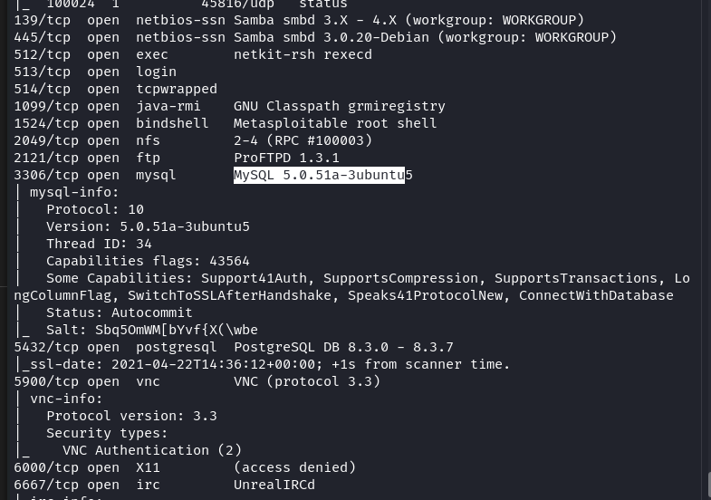

# Metasploitable
Скачайте и установите на виртуальную машину Metasploitable: https://sourceforge.net/projects/metasploitable/

### Какие сетевые службы в ней разрешены?

### Какие уязвимости были вами обнаружены (список со ссылками - достаточно 3х уязвимостей)

> Парочка на MySQL 5.0.x
> - https://www.exploit-db.com/exploits/30020
> - https://www.exploit-db.com/exploits/29724

> Одна  на ProFTPd IAC 1.3.x
> - https://www.exploit-db.com/exploits/15449

> Парочка на Samba 3.0.20
> - https://www.exploit-db.com/exploits/7701
> - https://www.exploit-db.com/exploits/16320

# SYN, FIN, Xmas, UDP
Проведите сканирование Metasploitable в режимах SYN, FIN, Xmas, UDP, запишите сеансы сканирования в Wireshark.

### Чем отличаются эти режимы сканирования с точки зрения сетевого трафика?
### Как отвечает сервер?

> SYN  
> - пакеты в качестве запроса по протоколу TCP, 
> - ответы по TCP [RST, ACK]

> FIN 
> - пакеты в качестве запроса по протоколу TCP, 
> - ответы по TCP [RST, ACK]

> Xmas 
> - FIN, PSH, URG в одном пакете по протоколу TCP, 
> - ответы по TCP [RST, ACK]

> UDP
> - пакеты в качестве запроса по протоколу UDP, 
> - без флага -T5, проходит большое количество запросов и получение всех ответов о недоступности, дождаться завершения не удалось.
> - ответы по ICMP о недоступности запрашиваемых портов
