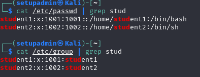
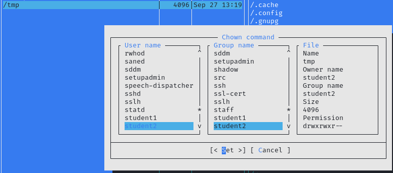
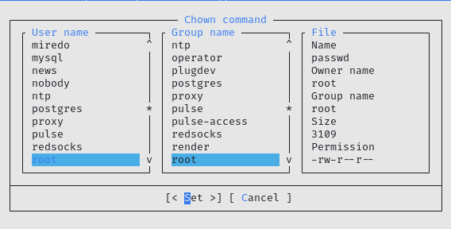
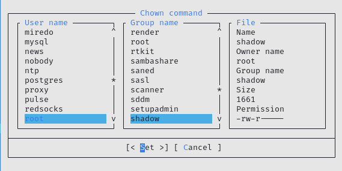

# «Linux Hardening»
### В качестве результата пришлите ответы на вопросы в личном кабинете студента на сайте netology.ru.

## Задание 1.
### Создайте пользователя student1 с оболочкой bash, входящего в группу student1.

### Создайте пользователя student2, входящего в группу student2.

## Задание 2.
### Создайте в общем каталоге (например, /tmp) директорию и назначьте для неё полный доступ со стороны группы student2 и доступ на чтение всем остальным

## Задание 3.
### Какой режим доступа установлен для файлов /etc/passwd и /etc/shadow?

### Объясните, зачем понадобилось именно два файла?

> Файл /etc/passwd ведет список всех пользователей системы.

> Файл /etc/shadow хранит запись о паролях зашифрованы пользователями, а также других паролях связанной с ними информацию.

## Задание 4*.
### Изучите информацию о SELinux из открытых источников.

### Что из того, предлагает SELinux, может быть реализовано в стандартном Linux?

> Как минимум настроить и писать логи можно и в стандартном Linux.

### Можно ли установить SELinux поверх существующей ОС Linux?

> Можно. SELinux включён в состав ядра Linux (начиная с версии 2.6).

> Также для функционирования SELinux требуются модифицированные версии некоторых утилит (ps, ls и других), которые обеспечивают поддержку новых функций ядра, и поддержка со стороны файловой системы.

