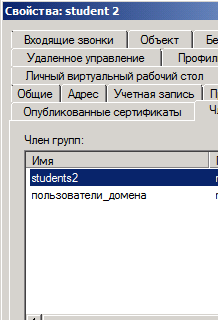

#  «Active Directory, часть 1»

## Задание 1.
Скачайте и установите Windows Server 2019 (2016):
https://www.microsoft.com/en-us/evalcenter/evaluate-windows-server-2019

Настройки виртуальной машины:

два сетевых интерфейса (NAT и внутренняя сеть)
оперативная память - 2-4 Гб.
Настройте Active Directory, воспользовавшись материалами из открытых источников:
https://1cloud.ru/help/windows/active-directory-domain-services-ustanovka-i-nastrojka-windows-server

https://habr.com/ru/company/testo_lang/blog/525326/

https://efsol.ru/manuals/active-directory.html

Приведите ответ в виде снимков экрана.

> Установить по инструкции не составит труда, но нехватает времени катастрофически. Поэтому, выполнил задание на AD в своей организации.

## Задание 2.
Создайте в AD:

пользователя student1, входящего в группу students1.

пользователя student2, входящего в группу students2.

Приведите ответ в виде снимков экрана.

## Задание 3.
Создайте или используйте существующую ВМ с установленной ОС Windows и подключите к домену:

https://docs.microsoft.com/ru-ru/windows-server/identity/ad-fs/deployment/join-a-computer-to-a-domain

Зайдите под доменными учётными записями.

Приведите ответ в виде снимков экрана.

## Задание 4*.
Настройте любую политику GPO и проверьте, что она распространилась на рабочую станцию:

https://1cloud.ru/help/windows/gruppovye-politiki-active-directory

https://windowsnotes.ru/activedirectory/primenenie-gruppovyx-politik-chast-1/

Приведите ответ в виде снимков экрана.

