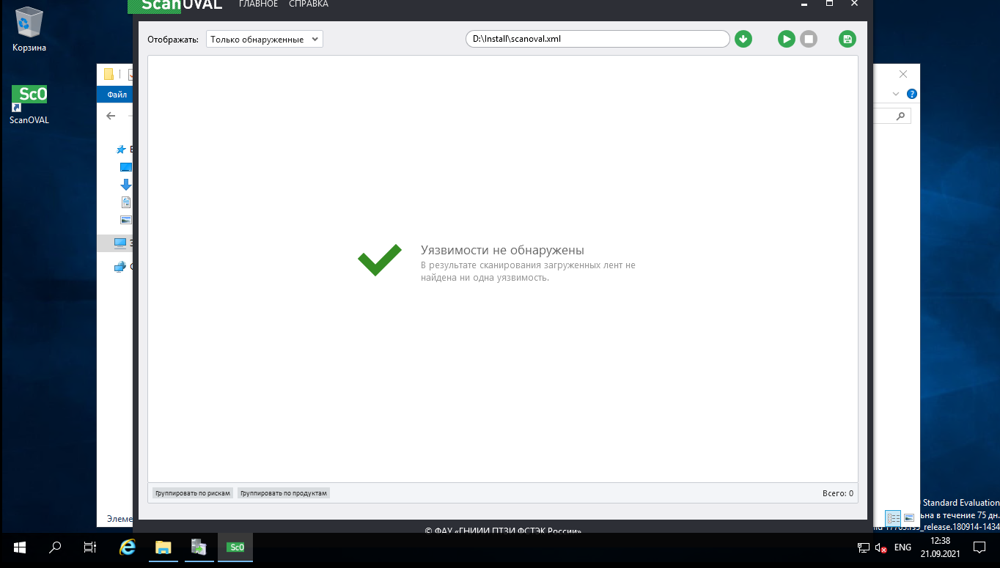
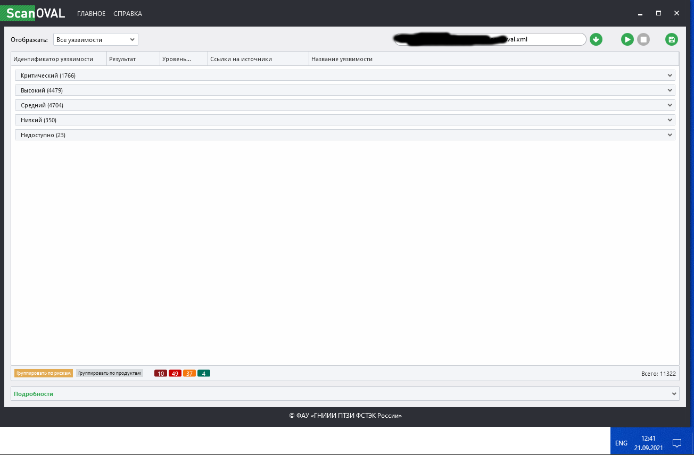

# «Active Directory, часть 2»
В качестве результата пришлите ответы на вопросы в личном кабинете студента на сайте netology.ru.

Задание 1.
Воспользовавшись лекцией, проведите самостоятельный аудит установленного на прошлом занятии DC.

Приведите ответ в свободной форме.

> Проверка одного из серверов нашей компании (ниже) - аудит прошёл успешно )))

> Проверка одной из тестовых виртуалок (ниже) - тут надо поработать над безопасночтью, как минимум её обновить.

    Дз принято, если хорошо разбираетесь в AD то по второй части можете что нибудь закастомить, почитать про GoldenTicket, компрометацию домена и рассказать как это предовтратить/задетектить и среагировать.

                            Антон Лукашов ПРЕПОДАВАТЕЛЬ

> Изучил что есть Golden Ticket(продвижение по AD от лица учётки krbtgt), и в первой строке поиска нашёл хорошую статью на Хабре.

> что бы задетектить использование данной уязвимости, нужно сравнивать пару TGT(генерирует сам) & TGS(Нужно запрашивать у домена).

> Основная реакция это смена пароля "Даже если сеть уже скомпрометирована и злоумышленники выпустили Golden Ticket, изменение пароля делает этот Ticket бесполезным. И им снова нужно начинать все сначала."