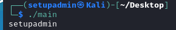
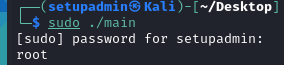

### «Системное программирование (язык C) - основы языка»

1. Что было выведено в каждой команде?

2. За что отвечает команда whoami (попробуйте её выполнить без Си, просто в терминале, заодно можете прочитать справку - man whoami, используйте клавишу q для выхода)?

- whoami печатает имя пользователя.

3. Какую роль выполняет функция system (вы можете подтвердить свои гипотезы экспериментом, прописав вместо whoami другие команды и прочитав документацию)?

- Используя system (), мы можем выполнить любую команду, которая может быть запущена на терминале.