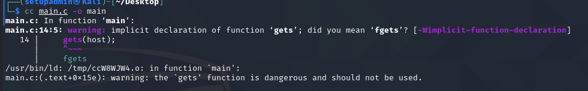
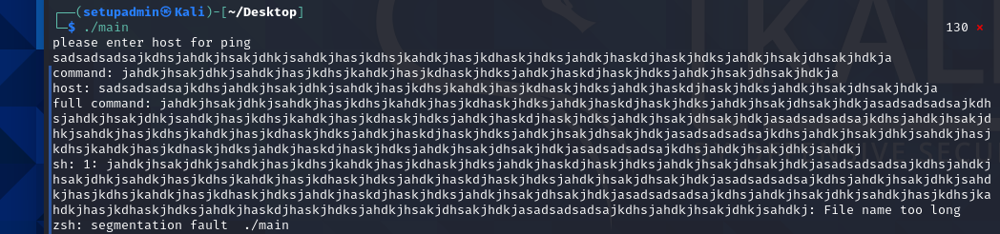
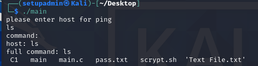

1. Какое предупреждение (Warning) было выведено при компиляции? По желанию: проведите доп.исследование на предмет сути предупреждения (с чем оно связано, какие риски от использования одной из функций в программе и что это за функция).

- Первое предупреждение Warning уточняет у нас может мы имели в виду функцию fgets?
- Второй warning сообщает нам чт функция gets опасна и не должна использоваться.
- Первый интернет-червь (интернет-червь Морриса) сбежал более 30 лет назад (1988-11-02), и он использовал gets() и переполнение буфера в качестве одного из своих методов распространения от системы к системе. Основная проблема заключается в том, что функция не знает, насколько велик буфер, поэтому она продолжает чтение до тех пор, пока не найдет новую строку или не встретит EOF, и может переполнить границы буфера, который ей был дан.

2. Ввод, приводящий к падению приложения

3. Ввод, приводящий к выполнению другой команды (не ping)

- Водим ls и 14 пробелов после неё.
- получаем:

