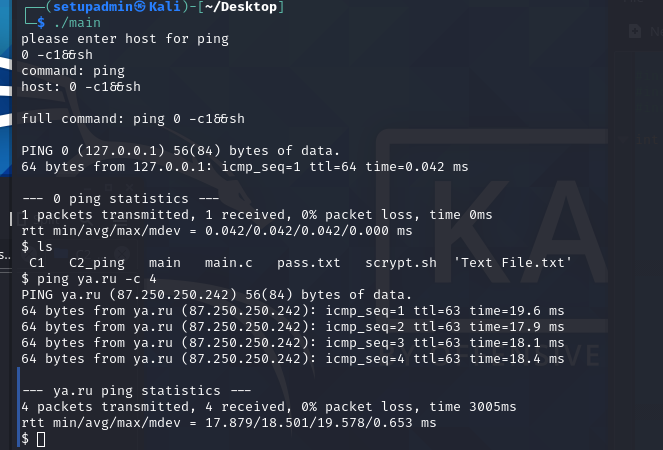

1. Можно ли реализовать переполнение?

- реализовать переполнение не удаётся

2. Можно ли выполнить произвольную команду (если да, то как)?

- Можно, введя в строку хоста,
 
        0 -с 1 && ls

3. Если ответ на п.2 - да, то можно ли получить shell (т.е. запустить sh и bash и продолжить работу с интерпретатором команд в интерактивном режиме)?

