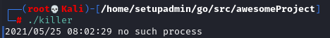
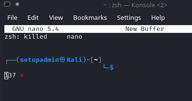
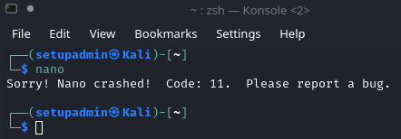
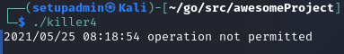
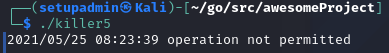
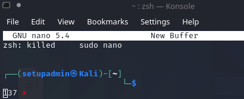
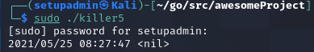

### Задача "Syscall"

1. Какое сообщение выводится, если вы указали несуществующий PID?

2. Что происходит с процессом, при отправке сигнала syscall.SIGKILL?

3. Что происходит с процессом, при отправке сигнала syscall.SIGSEGV?

4. Что выведет программа killer, если попытаться отправить сигналы PID = 1? Что это за процесс с PID = 1?
> процесс с PID = 1 называется systemd, это подсистема инициализации и управления службами в Linux

5. Что произойдёт*, если запустить nano с помощью sudo, а killer от лица обычного пользователя?

6. Что произойдёт*, если запустить nano с помощью sudo и killer с помощью sudo (sudo ./killer)?
> Nano

> Killer

7. Что произойдёт, если попытаться отправить сигналы PID = 1 с помощью sudo (sudo ./killer)?

> Systemd продолжет работать.

8. Проведите небольшое исследование и выясните, за что отвечают сигналы SIGKILL и SIGSEGV

> SIGKILL — сигнал, посылаемый процессам для их немедленного завершения

> SIGSEGV(signal of segmentation volation) — сигнал, используемый в POSIX-системах, посылаемый процессу при ошибках сегментации — отказах страниц и других попытках обращения к несуществующей области памяти или при обращениях с нарушением прав доступа.

> Это сервисный сигнал, которой, видимо, должен использоваться при нарушении в работе программы.

