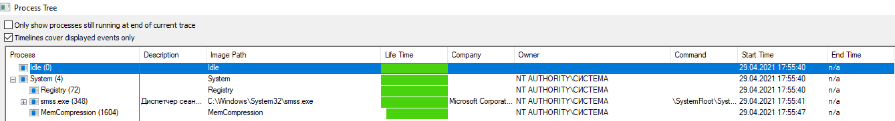
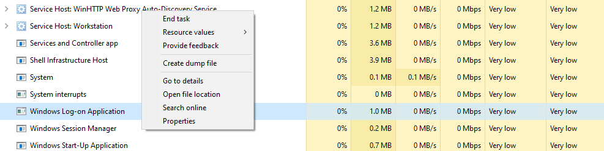
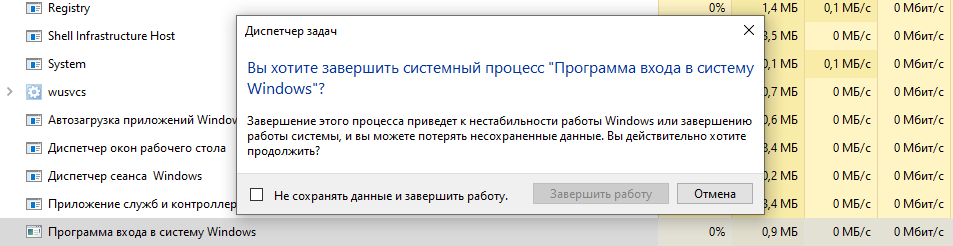

# Задача  Procmon

1. Какой процесс отображается в логе первым? Какой у него PID?

2. Какой "драйвер" загружается первым? Что это за драйвер (ответьте своими словами)?
> Первый загружается драйвер программы Process Monitor, он нужен для логирования и отслеживания всех поледующих процессов которые запускаются в системе.

3. Какой PID у родительского процесса для smss.exe (не у самого smss.exe, а у того, кто его создал)?
> Parent PID - 4    

4. Какой процесс является родительским для процесса winlogon.exe? 
> PID 480 - smss.exe
4. Где расположен файл winlogon.exe?
> C:\Windows\System32\winlogon.exe

5. Какой процесс является родительским для процесса lsass.exe?
> PID 488 - wininit.exe

6. Что будет если в таск менеджере (taskmgr.exe) завершить работу следующего процесса:

> Происходит перезапуск системы.

