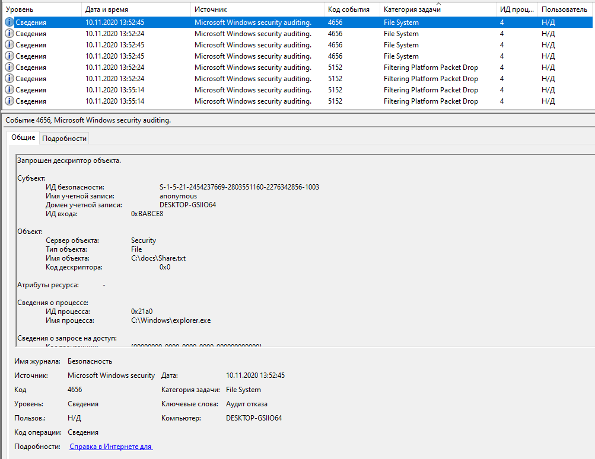
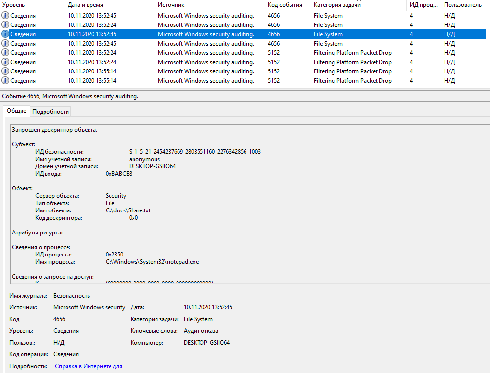
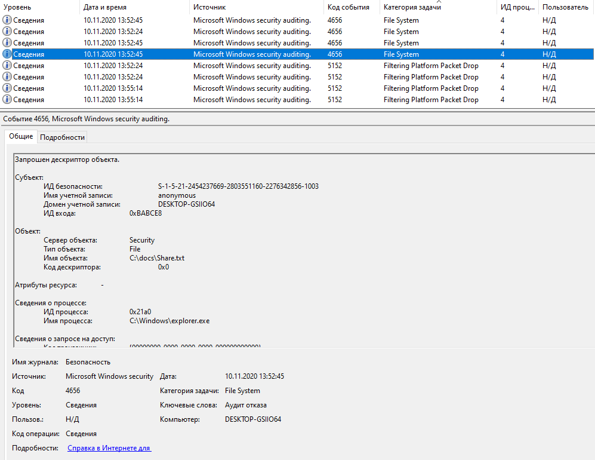

# Задача Audit
Легенда
На лекции мы рассмотрели работу с EventViewer'ом и журналом событий. В это ДЗ вам необходимо будет закрепить данные навыки и проанализировать готовый журнал событий.

Задача
Скачайте выгрузку журнала событий и предоставьте ответы на следующие вопросы:

1. Для каких пользователей (логины и SID'ы) зарегистрированы события типа Audit Failure (в русскоязычной Windows - Аудит отказа) по доступу к файлу Share.txt?
> - anonymous S-1-5-21-2454237669-2803551160-2276342856-1003
> - teacher S-1-5-21-2454237669-2803551160-2276342856-1001

2. Каковы ID событий (Event ID) и время, когда это было зафиксировано (в русскоязычной Windows Код события)?
> 4656 10.11.2020 13:52:45	for anonymous

> 4656 10.11.2020 13:52:24	for teacher
3. С помощью каких процессов (приложений) была осуществлена попытка доступа (в русскоязычной Windows Имя процесса)?
> anonymous 
> - C:\Windows\explorer.exe
> - C:\Windows\System32\notepad.exe

> teacher C:\Windows\System32\notepad.exe

