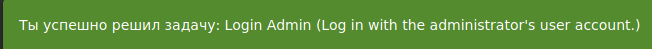
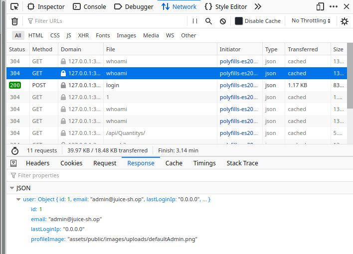
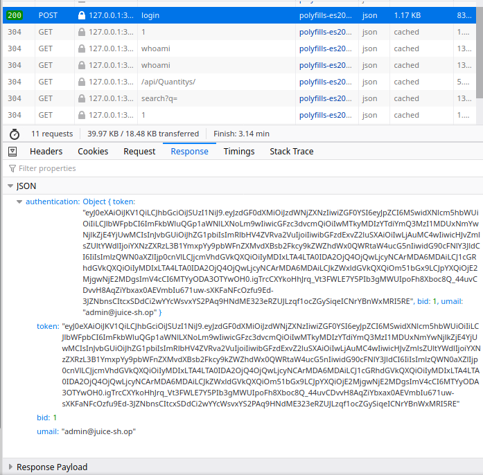

# 2.1 OWASP

## Задание SQLi

1. Использованные вами для ввода данные
> ' or 1=1 --

2. Информацию о том, под каким пользователем вам удалось войти

> Ты успешно решил задачу: Login Admin (Log in with the administrator's user account.) 

3. Ваши предположения о том, почему удалось войти именно под этим пользователем

> Потому что почта админа содерждится в json запросе, наверное )))

4. Информацию о том, где хранится аутентификационная информация, что она из себя представляет и как передаётся в каждом запросе

> Информация хранится в Cookie, LocalStorage, SessionStorage. Представляет из себя токены, передаётся в открытом виде.

## Задание robots.txt

В качестве результата пришлите: ваше заключение о том, корректно ли используется robots.txt (если нет, то почему и к каким это ведёт последствиям)

> В попытке защитить содержимое каталога со всем его содержимым была допущена ошибка. Чтобы запретить сканирование каталога со всем его содержимым, поставьте после названия каталога косую черту. Должно быть так: 

    Disallow: /ftp/

## Задание Взлом администратора*

В качестве результата пришлите: какой пароль стоял у администратора и какие меры позволили бы защититься от атаки.