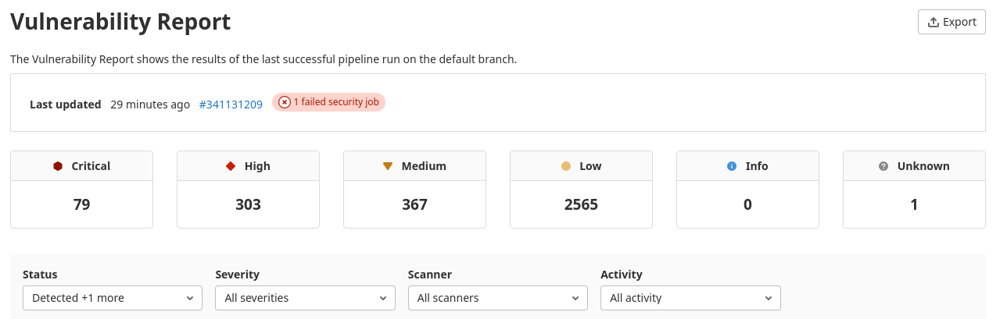
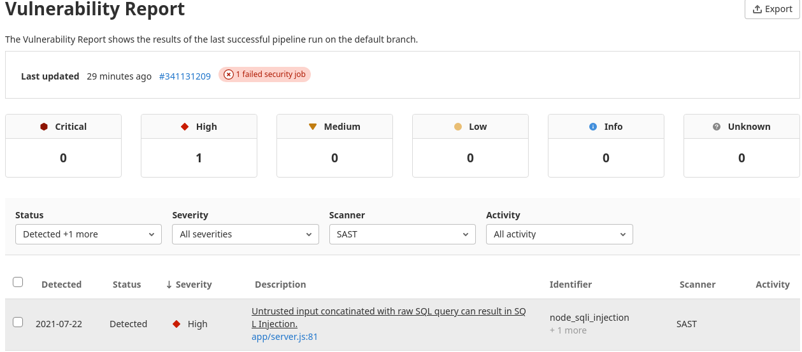
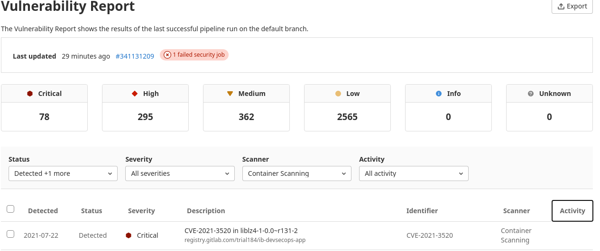
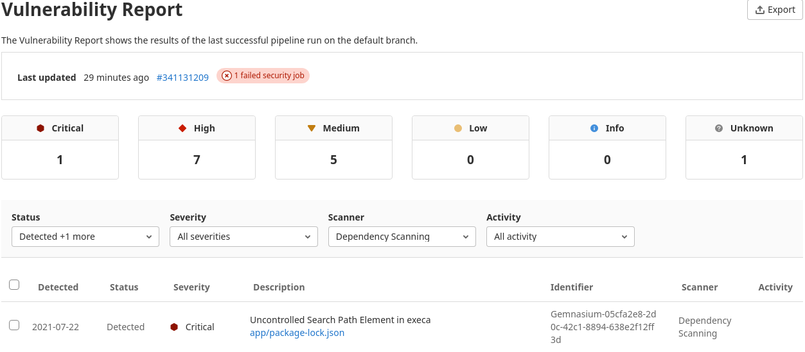
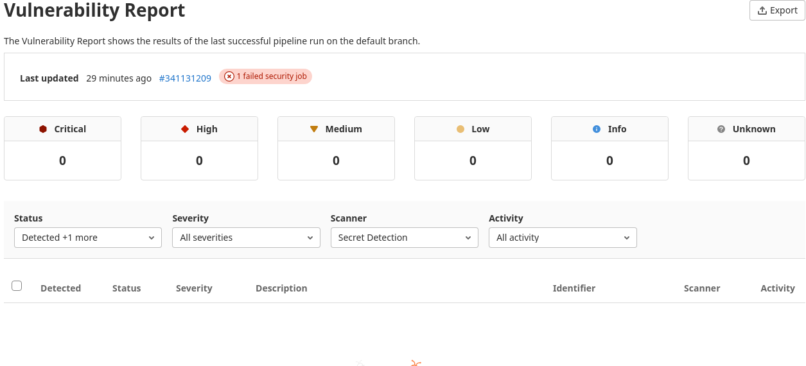
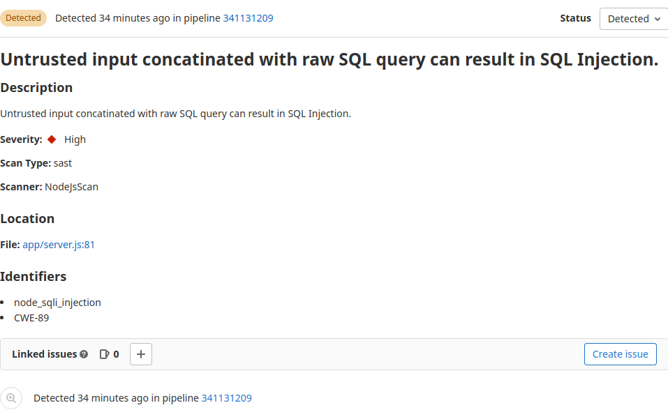
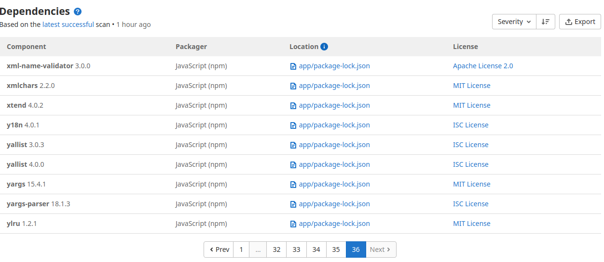

### 1. Сколько уязвимостей и какого уровня значимости найдено (Severity)

### 2. Сколько из них:
#### В самом приложении (SAST)

#### В контейнерах (Container Scanning)

#### В зависимостях (Dependency Scanning)

#### Секретов (Secret Detection)

### 3. Какая уязвимость найдена в самом приложении?

### 4. Сколько зависимостей в приложении?

> 709 штук.

### 5. Сколько различного рода лицензий используется в приложении и его зависимостях?

> MIT License

> ISC License

> BSD 2-Clause "Simplified" License

> BSD 3-Clause "New" or "Revised" License

> Creative Commons Zero v1.0 Universal

> Creative Commons Attribution 3.0 Unported

> Apache License 2.0

> Academic Free License v2.1
