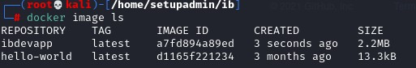
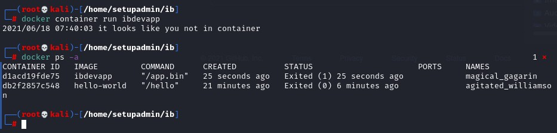
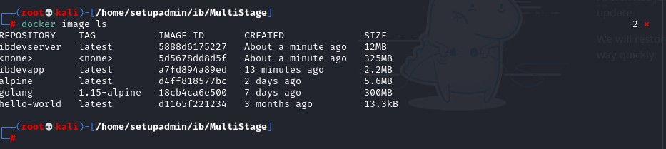
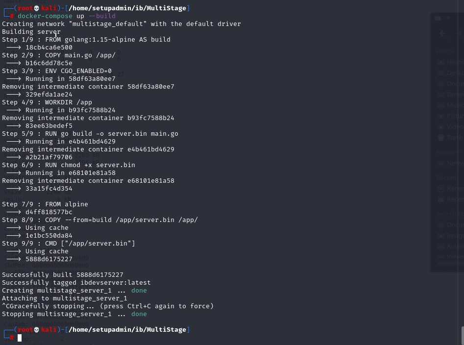
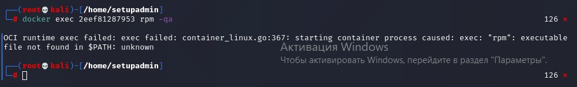

# 1.1. Контейнеризация (Docker)

## Задание №1. Создание Docker Image

В качестве результата работы пришлите:

### Скриншот вывода команды docker image ls

### Скриншот вывода команды docker container run ibdevapp

## Задание №2. MultiStage Build

В качестве результата работы пришлите:

### Скриншот вывода команды docker image ls

### Скриншот вывода команды docker-compose up --build

## Задание №3. CIS Benchmarks*
Важно: эта задача не обязательная, её (не)выполнение не влияет на получение зачёта по ДЗ.

Изучите CIS Benchmarks для Docker версии 1.2.0 (а именно раздел 4). Попробуйте проанализировать данный раздел и предположить, какие именно рекомендации мы точно нарушили при построении образа из задачи №2.

Нас интересуют конкретно:

Пункт 4.1

> Нужно было создать отдельного nonroot пользователя для запуска контейнера в продакшн. По умолчанию контейнеры запускаются с правами root, а также запускаются от имени пользователя root внутри контейнера.

Пункт 4.3

> Не удается получить список  установленных пакетов командой приведённой в скриншоте.

Примечание*: остальные пункты мы будем обсуждать на следующих лекциях.