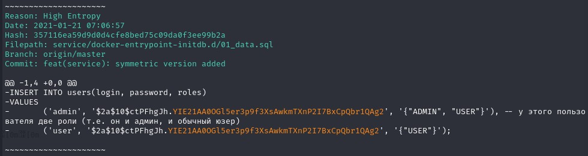
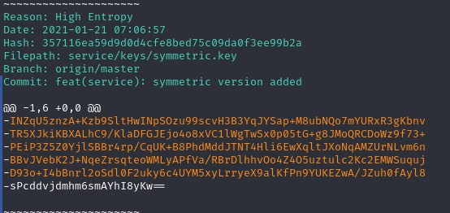
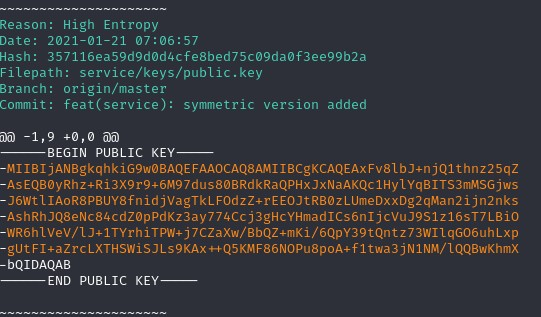
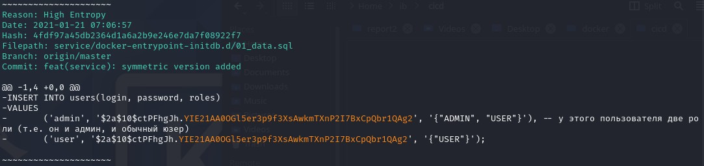

# 1.3 Системы контроля версий и CI/CD

## 1. Задание truffleHog

Пришлите в личном кабинете студента найденные вами "секреты" с описанием того, чтобы это могло быть (по вашему предположению).

> 1. Были найдены пара логин и пароль для админа и юзера.

> 2. Был найден приватный ключ шифрования, что является грубейшим упущением.

> 3. Так же был найден симметричный ключ.

> 4. И публичный ключ.

## 2. Задание BFG Repo-Cleaner 

Пришлите в личном кабинете студента общее заключение (в свободной форме) о выполнении разработчиками задачи по "вычистке" репозитория.

> Ключи шифрования были удалены, а вот логины и пароли остались.

