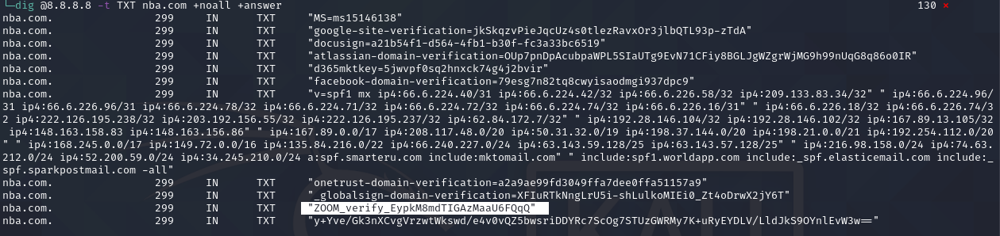
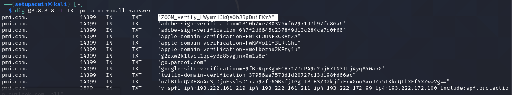
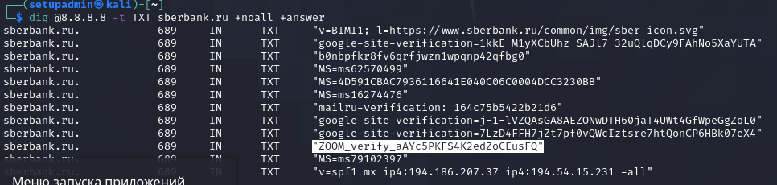
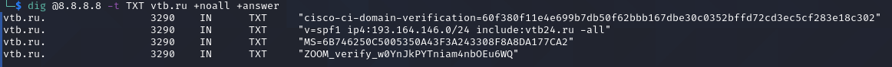
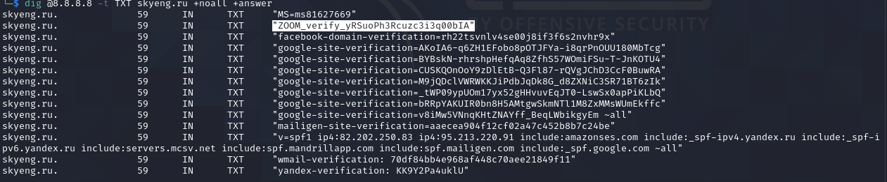

# Zoom
На любой Linux-машине (можете использовать Kali) с помощью утилиты dig найдите 5 компаний (доменов), которые скорее всего используют Zoom для своей работы.

В качестве результата необходимо отправить:

1. Описание (своими словами) как вы производили поиск
> - Для начала решил nba.com проверить. 
> -  Далее забежал на домен организации где товарищ на удалёнке работает. pmi.com 
> - Ну а потом можно и по банковским сайтам пробежаться. sberbank.ru и vtb.ru имеют такие записи, а вот тиньков и альфабанк нет...
> - Далее пришлось применить смекалку и задать в поисковике запрос: "компании на 100 % удаленке" и по второй же ссылке получил "Топ-15 работодателей, которые предлагают удаленную работу" вторым после яндекса был skyeng.ru, Бинго!

2. Список из 5 доменов со скриншотами
- nba.com

- pmi.com

- sberbank.ru

- vtb.ru

- skyeng.ru

# Internet*
Важно: эта задача является необязательной. Её (не)выполнение не влияет на получение зачёта по ДЗ.

Хост А успешно пингует Хост Б, но пинг между Хост А и Интернетом не работает.

Опишите своими словами, что настроено неправильно:
>    По моему мнению, неправильно настроен "статический кандидат по умолчанию" S* на R2, этот маршрут заворачивает все пакеты от певого роутера только на этот же интерфейс.