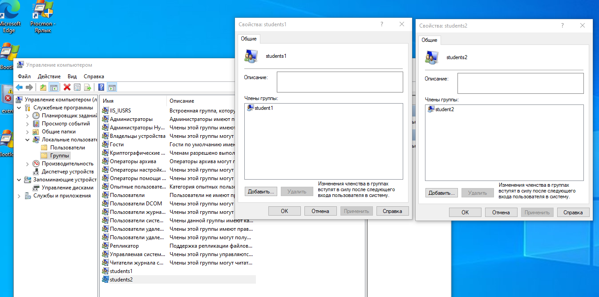
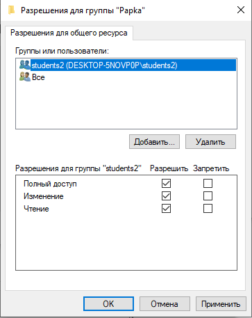
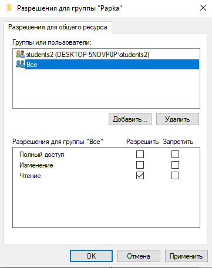
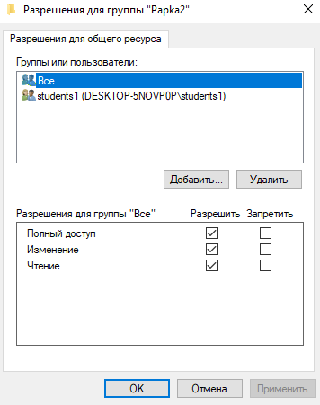
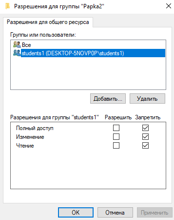

# «Windows Hardening»
В качестве результата пришлите ответы на вопросы в личном кабинете студента на сайте netology.ru.

## Задание 1.
### Создайте пользователя student1, входящего в группу students1.
### Создайте пользователя student2, входящего в группу students2.

## Задание 2.
### Создайте в общем каталоге папку и назначьте для неё полный доступ со стороны students2 и доступ на чтение остальным пользователям.

## Задание 3.
### Создайте в общем каталоге папку и назначьте для неё полный доступ для всех, кроме группы students1.

### Группа students1 не должна иметь доступа к содержимому этого каталога.

