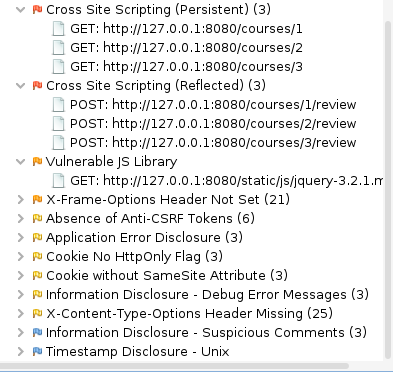

# «Penetration Testing (часть 2)»

## Задание 1.
### Запустите приложение из файла docker-compose.yml
Проведите пентест приложения, найдите как минимум 4 уязвимости. В ответе напишите какие уязвимости были найдены.

## Задание 2.
### После проведенного аудита, напишите небольшой отчет в формате  markdown или doc. Отчет должен содержать полезную информацию об уязвимостях, оценку критичноси, подтверждения нахождения и предложения по исправлению. Приложите отчет в личном кабинете студента.

[Отчёт](https://github.com/YUKalabin/SIB-5-IBB/blob/main/HW_IBDef/HW_IBDef_07_Penetration2/report.md)