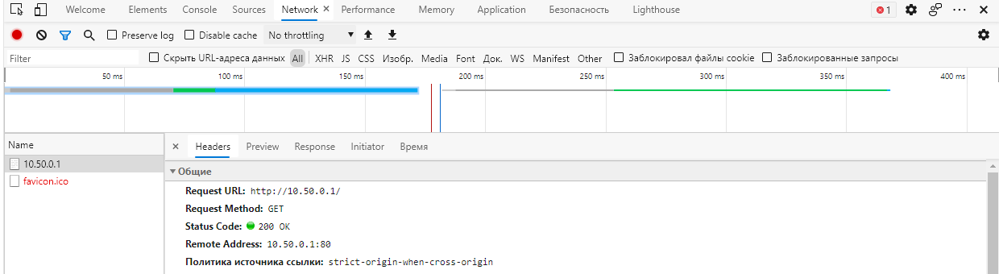

1. Скриншот, либо содержимое файла `app.service`
        
        [Unit]
        Description=Helloo
        After=network.target auditd.service

        [Service]
        ExecStart=/opt/app/server.bin
        Restart=on-failure
        WorkingDirectory=/opt/app

        [Install]
        WantedBy=multi-user.target

2. Ответы на впоросы:
    - На каком IP и порту запускается сервис
        > starting server on 0.0.0.0:9999
        
    - Кто (IP и порт) шлёт запросы на этот сервис и на какой путь
        > incoming request GET /api/token from 127.0.0.1:59546
    
    - Какие ответы (формат) получает клиент из п.ii получает в ответ на свои запросы
        >  {"ID":"80f6b6a4d6098f06eca0","status":"ok"}

    - Какой ответ (HTTP статус код) получите вы, если пошлёте из браузера запрос на этот же адрес (сертификат самоподписанный, поэтому вам необходимо принять его)
    > Скриншот
    
