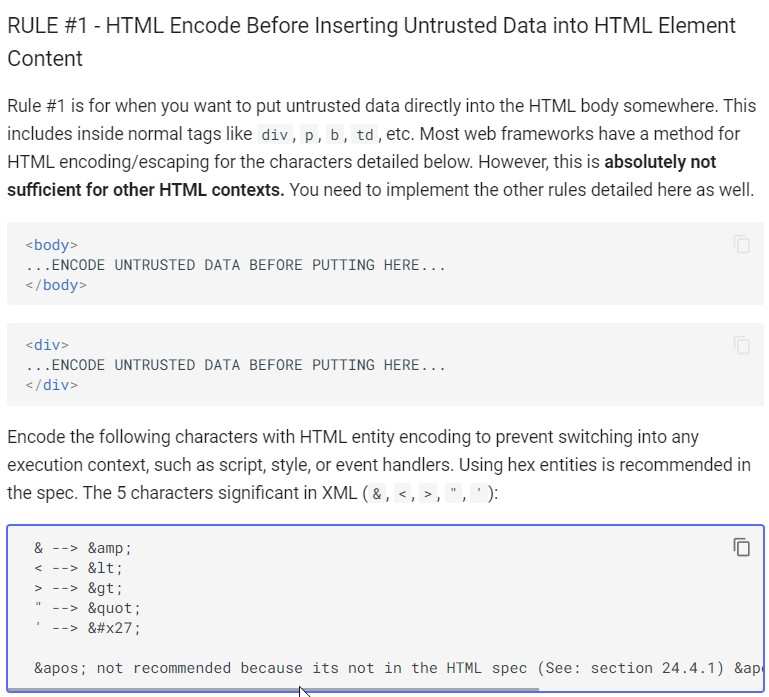

# Домашнее задание к занятию «2.2 OWASP»

## Задание Поиск
В качестве Cheat Sheet'а, содержащего примеры возможного вода для проверки подверженности XSS рекомендуем вам использовать XSS Cheat Sheet от OWASP.

Порядок выполнения
Проверьте поле поиска на сайте на подверженность XSS.

Проанализируйте, возможно ли ссылку, полученную в результате ввода в строку поиска передать другому человеку, чтобы получить Reflected XSS.

Результаты
В качестве результата пришлите:

### Использованные вами для ввода данные

```
<body><button onclick="alert('test')">Click me</button></body>
```

### Пункт из XSS Cheat Sheet, в котором содержится пример, использованный вами для проверки подверженности поля поиска XSS




## Задание Чужая корзина
Найдите IDOR в корзине. Посмотрите что лежит в чужих корзинах.

Результаты
В качестве результата пришлите:

### Наименование параметра который отвечает за открываемую корзину

```
ID пользователя, и вы в чужой корзине
```

### Ваши рекомендации по исправлению такой незначительной уязвимости.

```
Привязать доступ к корзине к сессии определённого пользователя, без ввода пароля вход невозможен.
```